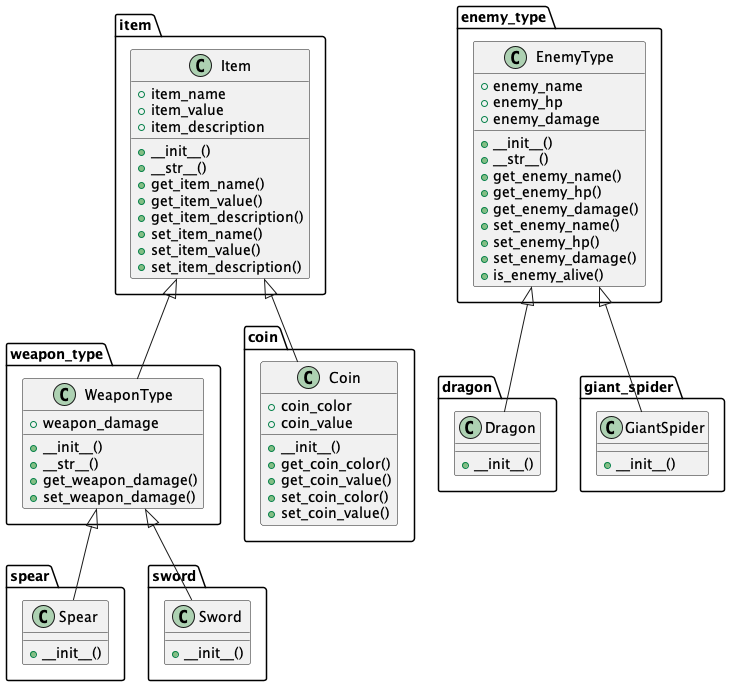

<a name="readme-top"></a>

<div align="center">
  <a>
    
  </a>

<h3 align="center">UMLement</h3>

[](https://github.com/imjuliengaupin/umlement/actions/workflows/devops.yml)
[](https://coveralls.io/github/imjuliengaupin/umlement?branch=PROD)

<a href="#demo">View Demo</a>
·
<a href="#ci-cd">View Docs</a>
·
<a href="https://github.com/imjuliengaupin/umlement/issues">Report Bug</a>
·
<a href="https://github.com/imjuliengaupin/umlement/issues">Request Feature</a>

</div>

## :rocket: <a name="setup">Getting Started</a>

### <ins>Prerequisites</ins>

1. Clone the repo

   ```sh
   git clone https://github.com/imjuliengaupin/umlement.git
   ```

2. Install pip packages

   ```sh
   pip3 install -r requirements.txt
   ```

3. Install [Graphviz](https://graphviz.org/download/). Below is a sample installation via [Homebrew](https://formulae.brew.sh/formula/graphviz) on `macOS`

   ```sh
   brew install graphviz
   ```

4. Download the latest PlantUML `JAR` from [here](https://plantuml.com/download) and move it into a new folder named `resources` located in the cloned repo's root directory

   ```sh
   mkdir /path/to/umlement/resources
   mv /path/to/jar/download/*.jar /path/to/umlement/resources
   ```

### <ins>Usage</ins>

- individual python files

  ```sh
  python3 umlement.py file1.py file2.py ... fileN.py
  ```

- folders

  ```sh
  python3 umlement.py /path/to/folder
  ```

<p align="right">
    (<a href="#readme-top">back to top</a>)
</p>

## :gear: <a name="features">Features</a>

- [x] Programatially generate class inheritance models using `PlantUML`
- [x] Class inheritance diagram generation using `Graphviz`
- [x] `python3` syntax pattern matching using `regex`
- [x] Dynamic python script `argvs`, options include
  - [x] individual `.py` files
  - [x] folders

<br />

_See the [open issues](https://github.com/imjuliengaupin/umlement/issues) for a full list of proposed features (and known issues)._

<p align="right">
    (<a href="#readme-top">back to top</a>)
</p>

## :repeat: <a name="ci-cd">CI/CD</a>

- [x] Automated code builds using a custom [GitHub Workflow](https://docs.github.com/en/actions/using-workflows) pipeline
  - [x] code linting using `pylint`
  - [x] static type checking using `mypy`
  - [x] unit testing using `pytest`
  - [x] code coverage reports using `pytest-cov` with [Coveralls](https://coveralls.io/) integration
  - [x] code documentation using `pdoc3`

<br />

_See the document [artifacts](https://github.com/imjuliengaupin/umlement/actions) generated for this project from the latest GitHub workflow action summary._

<p align="right">
    (<a href="#readme-top">back to top</a>)
</p>

## :computer: <a name="demo">Demo</a>




<p align="right">
    (<a href="#readme-top">back to top</a>)
</p>

## :handshake: <a name="contribute">Contributing</a>

If you find interest in this project and want to share your own insights, enhancements, or bugfixes, please feel free to contribute!

1. Fork the project
2. Create your feature branch `git checkout -b feature/branchname`
3. Commit your changes `git commit -m 'description'`
4. Push your feature branch `git push origin feature/branchname`
5. Open a pull request

<p align="right">
    (<a href="#readme-top">back to top</a>)
</p>

## :pencil: <a name="license">License</a>

Distributed under the MIT License. See `LICENSE.md` for more information.

<p align="right">
    (<a href="#readme-top">back to top</a>)
</p>
