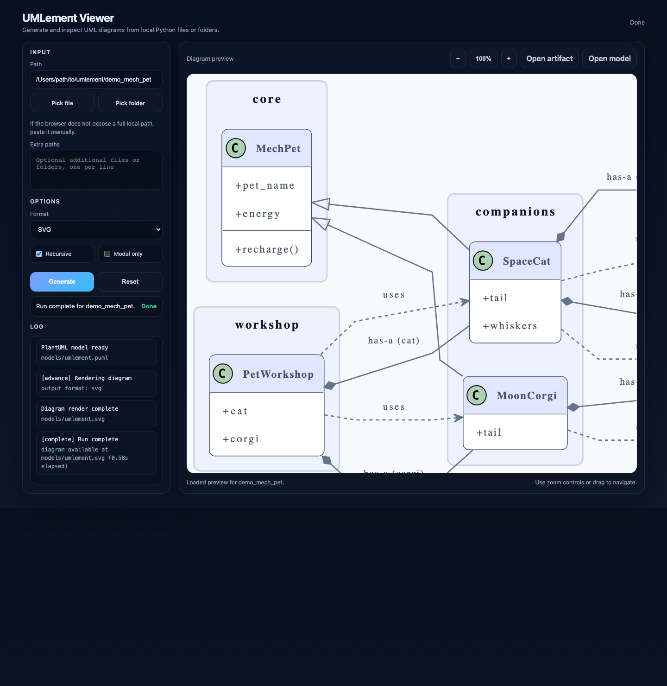

<a name="readme-top"></a>

<div align="center">
  <a>
    
  </a>

<h3 align="center">UMLement</h3>

<p>Reverse-engineer Python projects into readable UML class diagrams</p>

[](https://github.com/imjuliengaupin/umlement/actions/workflows/devops.yml)
[](https://coveralls.io/github/imjuliengaupin/umlement?branch=PROD)

<p align="center">
  <a href="#why-umlement">Why UMLement?</a> •
  <a href="#features">Features</a> •
  <a href="#use-cases">Use Cases</a> •
  <a href="#quick-start">Quick Start</a> •
  <a href="#how-it-works">How It Works</a> •
  <a href="#usage">Usage</a> •
  <a href="#demo">Demo</a> •
  <a href="#quality-reliability">Quality & Reliability</a> •
  <a href="#license">License</a>
</p>

</div>

<br />

## <a name="why-umlement">Why UMLement?</a>

When you inherit a Python codebase, the class structure is often harder to understand than the code itself. UMLement makes that first-pass architectural read faster.

It is built for:

- **Fast reverse engineering** - Generate UML from Python files or folders without heavy setup
- **Readable diagram output** - Produce PlantUML plus rendered SVG or PNG artifacts you can actually use in docs and handoff notes
- **Practical local tooling** - Use it from the CLI or a lightweight local web UI
- **Intentionally small scope** - Focused, useful, and not padded with feature sprawl

<p align="right">
  (<a href="#readme-top">back to top</a>)
</p>

## :gear: <a name="features">Features</a>

- [x] **AST-backed class discovery**: Reverse-engineer Python source more reliably than simple text parsing
- [x] **Relationship extraction**: Emit inheritance, composition (`has-a`), and usage edges
- [x] **Import-aware local scanning**: Auto-include sibling modules referenced by local imports
- [x] **Compact default UML**: Cleaner class diagrams by hiding getter/setter noise unless explicitly requested
- [x] **Custom PlantUML styling**: Cleaner output than bare PlantUML defaults
- [x] **SVG or PNG rendering**: Generate a PlantUML model plus a rendered image artifact
- [x] **Recursive project scanning**: Walk folders for broader architectural coverage
- [x] **Local viewer UI**: Preview diagrams, zoom, fit to width, drag to pan, and open generated artifacts
- [x] **Model-only mode**: Generate `.puml` without rendering an image when you only want the source model
- [x] **Progress reporting**: CLI and local UI both surface useful run progress

<p align="right">
  (<a href="#readme-top">back to top</a>)
</p>

## :bulb: <a name="use-cases">Use Cases</a>

**Architecture discovery**

- Inspect the class structure of an unfamiliar Python project
- Understand inheritance and object composition quickly
- Create lightweight architecture notes before deeper refactors

**Documentation & handoff**

- Generate UML artifacts for internal docs
- Support project handoff with structural visuals instead of prose alone
- Capture useful diagrams for README, docs, or portfolio walkthroughs

**Developer tooling workflows**

- Scan a whole folder recursively for broader project context
- Target specific files when you only care about a subset of the codebase
- Generate PlantUML source for further manual editing when needed

<p align="right">
  (<a href="#readme-top">back to top</a>)
</p>

## :rocket: <a name="quick-start">Quick Start</a>

### Prerequisites

- Python 3.10+
- Java
- PlantUML jar in `resources/`

### Installation

```bash
# Clone the repo
git clone https://github.com/imjuliengaupin/umlement.git
cd umlement

# Create a virtual environment and install dependencies
make setup
```

Add exactly one PlantUML jar to `resources/`, for example:

```bash
resources/plantuml-mit-1.2023.13.jar
```

You can download a PlantUML jar from the official releases page:

- <https://github.com/plantuml/plantuml/releases>

### Fastest run

```bash
make demo
```

That generates:

- `models/umlement.puml`
- `models/umlement.svg`

### Local UI

```bash
make ui
```

Then open:

- <http://127.0.0.1:5000>

For the canonical README screenshot workflow:

```bash
make ui-demo-image
```

That uses a dedicated capture flow on a clean local port and refreshes:

- `demo/images/ui-demo.png`

<p align="right">
  (<a href="#readme-top">back to top</a>)
</p>

## 🏗️ <a name="how-it-works">How It Works</a>

UMLement follows a simple pipeline:

1. **Validate input paths** - Accept Python files or folders
2. **Discover classes with AST parsing** - Extract classes, attributes, methods, bases, and relationships
3. **Build a PlantUML model** - Emit a `.puml` description of the discovered structure
4. **Render the diagram** - Generate SVG or PNG using the configured PlantUML jar
5. **Preview locally** - Use the Flask UI to inspect the generated artifact interactively

### Output model behavior

The current default output is intentionally compact:

- dunder methods are hidden
- getter/setter methods are hidden by default
- getter/setter methods can be restored with an explicit option when fuller member detail is needed

This keeps the default diagram more readable while preserving a path back to more verbose output.

<p align="right">
  (<a href="#readme-top">back to top</a>)
</p>

## 🧪 <a name="usage">Usage</a>

### Scan one or more files

```bash
python umlement.py file1.py file2.py
```

### Scan a folder

```bash
python umlement.py demo/sample_project
```

### Scan recursively

```bash
python umlement.py demo/sample_project --recursive
```

### Generate SVG instead of PNG

```bash
python umlement.py demo/sample_project --recursive --format svg
```

### Generate only the PlantUML model

```bash
python umlement.py demo/sample_project --recursive --model-only
```

### Show getter/setter methods in the UML model

```bash
python umlement.py demo/sample_project --recursive --show-accessors
```

### Show progress while it runs

```bash
python umlement.py demo/sample_project --recursive --format svg --progress
```

### Local UI behavior notes

The browser UI is designed for local runs, but one browser limitation is worth calling out:

- the **Input Path** field is the authoritative runnable input
- file/folder pickers preload names only, because browsers do not reliably expose a true absolute local path
- the path still needs to be completed manually before the run can start

Current UI options include:

- **Recursive folder scan** (folder-oriented runs only)
- **Model only (skip image render)**
- **Show getter/setter methods**
- built-in **Diagram / Model** viewer tabs
- diagram zoom and fit controls
- light/dark theme toggle

When **Model only** is enabled, the UI automatically locks **Show getter/setter methods** on so the generated PlantUML model includes accessor lines.

<p align="right">
  (<a href="#readme-top">back to top</a>)
</p>

## 🎬 <a name="demo">Demo</a>

### Local viewer UI

The local UI is best shown as a crisp static image because screenshots preserve interface quality much better than GIFs.



### Terminal workflow

The CLI demo is best shown as motion because the progress output is part of the product experience.


<p align="right">
  (<a href="#readme-top">back to top</a>)
</p>

## 💪🏼 <a name="quality-reliability">Quality & Reliability</a>

- **AST-backed scanning**: More robust than regex-only reverse engineering for Python class discovery
- **Typed regression coverage**: Pytest and mypy are part of the regular verification flow
- **Reproducible demo workflow**: Dedicated screenshot capture keeps UI/demo assets consistent
- **Pragmatic scope**: Small surface area, explicit tradeoffs, and no unnecessary feature sprawl

Useful development commands:

```bash
make setup
make test
make lint
make typecheck
make verify
make demo
make ui
make ui-demo-image
```

### Project structure

```text
.
├── demo/                    # sample project + demo assets
├── models/                  # generated PlantUML and rendered artifacts
├── resources/               # PlantUML jar location
├── scripts/                 # local demo/screenshot helpers
├── templates/               # Flask UI template
├── tests/                   # regression tests
├── ui_app.py                # local Flask viewer
├── uml_ast.py               # AST-based Python structure extraction
├── uml_generator.py         # PlantUML model + diagram generation
├── umlement.py              # CLI entrypoint
└── umlement_runner.py       # reusable programmatic runner
```

<p align="right">
  (<a href="#readme-top">back to top</a>)
</p>

## :pencil: <a name="license">License</a>

Distributed under the MIT License. See `LICENSE` for more information.

<p align="right">
  (<a href="#readme-top">back to top</a>)
</p>
