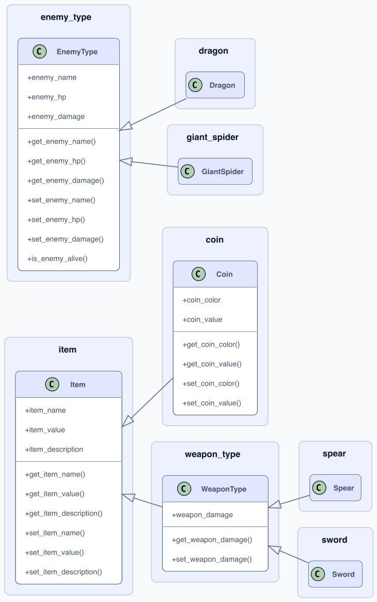

<a name="readme-top"></a>

<div align="center">
  <a>
    
  </a>

<h3 align="center">UMLement</h3>

<p align="center">
  Reverse-engineer Python projects into clean UML class diagrams for architecture docs, reverse engineering, and portfolio demos.
</p>

[](https://github.com/imjuliengaupin/umlement/actions/workflows/devops.yml)
[](https://coveralls.io/github/imjuliengaupin/umlement?branch=PROD)

<a href="#demo">View Demo</a>
·
<a href="#local-demo">Run Locally</a>
·
<a href="#features">Features</a>
·
<a href="https://github.com/imjuliengaupin/umlement/issues">Report Bug</a>
·
<a href="https://github.com/imjuliengaupin/umlement/issues">Request Feature</a>

</div>

## What it does

UMLement is a lightweight Python CLI that scans Python source files and generates:
- a PlantUML model (`.puml`)
- a rendered diagram (`.png` or `.svg`)

It is useful for:
- visualizing class inheritance in older codebases
- creating lightweight architecture artifacts for docs
- reverse engineering object-oriented project structure
- scanning an entire Python project or a hand-picked list of files/folders
- demonstrating code-analysis and developer-tooling work in a portfolio

## :rocket: Getting Started

### Prerequisites

- Python 3.10+
- Java
- Graphviz

### Setup

1. Clone the repo

   ```sh
   git clone https://github.com/imjuliengaupin/umlement.git
   cd umlement
   ```

2. Create a virtual environment and install dependencies

   ```sh
   python3 -m venv .venv
   . .venv/bin/activate
   pip install -r requirements.txt -r requirements-dev.txt
   ```

3. Ensure the PlantUML jar exists in `resources/`

   The repo currently expects a PlantUML jar at:

   ```sh
   resources/plantuml-*.jar
   ```

## Local demo

Fastest demo path:

```sh
make demo
```

Tiny local UI:

```sh
make ui
```
Then open <http://127.0.0.1:5000>.

The UI now includes three bundled sample projects so the tool can be demonstrated against different project shapes, not just one folder.

Manual run with visible progress output:

```sh
. .venv/bin/activate
python umlement.py demo --recursive --format svg --progress
```

That generates:
- `models/umlement.puml`
- `models/umlement.svg`

## Usage

### Scan one or more files

```sh
python umlement.py file1.py file2.py
```

### Scan a mix of folders and files

```sh
python umlement.py demo_space_cafe demo_mech_pet/workshop.py
```

For broader reverse-engineering coverage, scanning a project folder is usually better than targeting only one leaf file.

### Scan a folder

```sh
python umlement.py demo
```

### Scan recursively

```sh
python umlement.py demo --recursive
```

### Generate SVG instead of PNG

```sh
python umlement.py demo --recursive --format svg
```

### Generate only the PlantUML model

```sh
python umlement.py demo --recursive --model-only
```

### Show step-by-step status while it runs

```sh
python umlement.py demo --recursive --format svg --progress
```

## :gear: Features

- AST-backed class discovery for more robust Python project scanning
- inheritance and object-instantiation relationship extraction
- rendered output as PNG or SVG
- recursive folder scanning
- mixed input support across folders and explicit Python files
- step-by-step terminal progress output for demos
- tiny local web UI with run controls, bundled sample projects, progress log, and SVG preview
- CLI help/version support
- local demo assets for quick showcase runs
- lightweight CI for linting, type checking, tests, coverage, and docs

## Why it is interesting

UMLement sits in a nice niche between documentation tooling and code analysis. It is intentionally lightweight, but still useful as a practical reverse-engineering aid for Python projects.

That makes it a solid reference project for:
- static analysis ideas
- developer tooling
- architecture visualization
- CLI UX and automation

## Project structure

```text
.
├── demo/                 # sample Python classes for quick demo runs
├── models/               # generated PlantUML and diagram artifacts
├── resources/            # PlantUML jar location
├── tests/                # CLI and generator regression tests
├── uml_generator.py      # model + diagram generation
├── uml_regex.py          # regex-based parsing rules
└── umlement.py           # CLI entrypoint
```

## Development

Useful commands:

```sh
make setup
make test
make demo
make ui
make docs
```

## Current limitations

This project is still intentionally lightweight.

Current tradeoffs:
- analysis is stronger now that class discovery is AST-backed, but it is still intentionally lightweight rather than a full semantic analyzer
- relationship extraction is best on straightforward object-oriented Python patterns
- this is best positioned as a practical reverse-engineering tool, not a full type-aware architecture engine

## Demo




## Contributing

If you find this project interesting and want to share your own enhancements or bugfixes, contributions are welcome.

1. Fork the project
2. Create your feature branch `git checkout -b feature/branchname`
3. Commit your changes `git commit -m 'description'`
4. Push your feature branch `git push origin feature/branchname`
5. Open a pull request

## License

Distributed under the MIT License. See `LICENSE` for more information.
